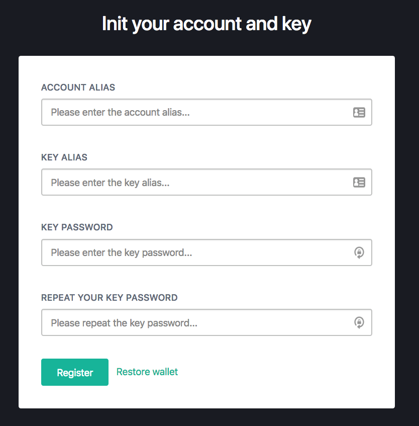

在前面一篇文章，我们粗略的研究了一下比原的dashboard是如何做出来的，但是对里面提到的各种细节功能，并没有深入的去研究。那么从本文开始，我们将在这一段时间，分别研究里面提到的每一项功能。

在前一篇文章中，当我们第一次在浏览器中打开dashboard时，因为还没有创建过密钥，所以比原会提示我们输入一些别名和密码，为我们创建一个密钥和相应的帐户。就是下面这张图所对应的：



那么本文就将研究一下，当我们点击了"Register"按钮以后，我们在前端页面上填写的参数，到底是如何一步步的传到比原的后端的。

跟之前一样，我们将对这个问题进行细分，然后各个击破：

1. 前端：当我们填完表单，点了提交以后，比原在前端是如何发送数据的？
2. 后端：比原的后端是如何接收到数据的？

前端：当我们填完表单，点了提交以后，数据会发送到后端的哪个接口？
-----------------------------------------------------

当我们点击了"Register"按钮，在前端页面中，一定会在某个地方触发一个向比原节点webapi接口发出请求的操作。究竟是访问的哪个web api？提交的数据又是什么样的呢？让我们先从前端代码中寻找一下。

注意，比原的前端代码位于另一个项目仓库[bytom/dashboard](https://github.com/Bytom/dashboard)中。为了能与我们在本系列文章中使用的比原v1.0.1的代码相匹配，我找到了dashboard中的v1.0.0的代码，并且提交到了一个单独的项目中：[freewind/bytom-dashboard-v1.0.0](https://github.com/freewind/bytom-dashboard-v1.0.0)。注意该项目代码未做任何修改，其`master`分支对应于官方代码仓库的`v1.0.0`分支。之所以要弄一个单独的出来，这是因为我们在文章中，每次引用一段代码的时候，都会给出相应的github上的链接，方便读者跳过去查看全貌，使用一个独立项目，会让这个过程更简便一些。

由于比原的前端页面是使用`React`为主的，所以我猜想在代码中，也该会有一个名为Register的组件，或者某个表单中有一个名为Register的按钮。经过搜索，我们幸运的发现了[Register.jsx](https://github.com/freewind/dashboard/blob/88bdb2aee30c7c70cb4750b0b34007b87ee1cdc3/src/features/app/components/Register/Register.jsx) 这个组件文件，它正好是我们需要的。

经过高度简化后的代码如下：

[src/features/app/components/Register/Register.jsx#L9-L148](https://github.com/freewind/bytom-dashboard-v1.0.0/blob/master/src/features/app/components/Register/Register.jsx#L9-L148)

```jsx
class Register extends React.Component {
  // ...
  // 4. 
  submitWithErrors(data) {
    return new Promise((resolve, reject) => {
      // 5. 
      this.props.registerKey(data)
        .catch((err) => reject({_error: err.message}))
    })
  }
  // ...

  render() {
    // ...
    return (
      // ...
      // 3.
      <form className={styles.form} onSubmit={handleSubmit(this.submitWithErrors)}>
        // 1.
        <TextField
          title={lang === 'zh' ? '账户别名' : 'Account Alias'}
          placeholder={lang === 'zh' ? '请输入账户别名...' : 'Please enter the account alias...'}
          fieldProps={accountAlias} />
        <TextField
          title={lang === 'zh' ? '密钥别名' : 'Key Alias'}
          placeholder={lang === 'zh' ? '请输入密钥别名...' : 'Please enter the key alias...'}
          fieldProps={keyAlias}/>
        <TextField
          title={lang === 'zh' ? '密钥密码' : 'Key Password'}
          placeholder={lang === 'zh' ? '请输入密钥密码...' : 'Please enter the key password...'}
          fieldProps={password}
          type='password'/>
        <TextField
          title={lang === 'zh' ? '重复输入密钥密码' : 'Repeat your key password'}
          placeholder={lang === 'zh' ? '请重复输入密钥密码...' : 'Please repeat the key password...'}
          fieldProps={repeatPassword}
          type='password'/>

        // 2. 
        <button type='submit' className='btn btn-primary' disabled={submitting}>
          {lang === 'zh' ? '注册' : 'Register'}
        </button>
        // ....
        </form>
      // ...
    )
  }
}
```

上面的代码，共有5个地方需要注意，被我用数字标示出来了。注意这5个数字并不是从上到下标注，而是按照我们关注的顺序来的：

1. 表单上的各个输入框，就是我们填写别名和密码的地方。这里需要关注的是每个`TextField`的`fieldProps`属性，它对应我们提交到后台的数据的`name`
2. 就是那个“Register”按钮了。需要注意的是，它的`type`是`submit`，也就是说，点击它以后，将会触发所在`form`的`onSubmit`方法
3. 回到了`form`的开头。注意它的`onSubmit`里面，调用的是`handleSubmit(this.submitWithErrors)`。其中的`handleSubmit`是从该表单所使用的第三方[redux-form](https://github.com/erikras/redux-form)中传入的，用来处理表单提交，我们在这里不关注它，只需要知道我们需要把自己的处理函数`this.submitWithErrors`传给它。而在后者中，我们将会调用比原节点提供的web api
4. 第3步中的`this.submitWithErrors`最终将走到这里定义的`submitWithErrors`函数
5. `submitWithErrors`将会发起一个异步请求，最终调用由外部传进来的`registerKey`函数

从这里我们还看不到调用的是哪个api，所以我们必须继续去寻找`registerKey`。很快就在同文件中找到了`registerKey`：

[src/features/app/components/Register/Register.jsx#L176-L180](https://github.com/freewind/bytom-dashboard-v1.0.0/blob/master/src/features/app/components/Register/Register.jsx#L176-L180)

```js
(dispatch) => ({
    registerKey: (token) => dispatch(actions.core.registerKey(token)),
    // ...
  })
```

它又将会调用`actions.core.registerKey`这个函数：

[src/features/core/actions.js#L44-L87](https://github.com/freewind/bytom-dashboard-v1.0.0/blob/master/src/features/core/actions.js#L44-L87)

```js
const registerKey = (data) => {
  return (dispatch) => {
    // ...
    // 1.1
    const keyData = {
      'alias': data.keyAlias,
      'password': data.password
    }
    // 1.2
    return chainClient().mockHsm.keys.create(keyData)
      .then((resp) => {
        // ...
        // 2.1
        const accountData = {
          'root_xpubs':[resp.data.xpub],
          'quorum':1,
          'alias': data.accountAlias}
        // 2.2
        dispatch({type: 'CREATE_REGISTER_KEY', data})

        // 2.3
        chainClient().accounts.create(accountData)
          .then((resp) => {
            // ...
            // 2.4
            if(resp.status === 'success') {
              dispatch({type: 'CREATE_REGISTER_ACCOUNT', resp})
            }
          })
    // ...
      })
    // ...
  }
}
```

可以看到，在这个函数中，做的事情还是很多的。而且并不是我一开始预料的调用一次后台接口就行了，而是调用了两次（分别是创建密钥和创建帐户）。下面进行分析：

1. `1.1`是为了让后台创建密钥而需要准备的参数，一个是`alias`，一个是`password`，它们都是用户填写的
2. `1.2`是调用后台用于创建密钥的接口，把`keyData`传过去，并且拿到返回的`resp`后，进行后续的处理
3. `2.1`是为了让后台创建帐户而需要准备的参数，分别是`root_xpubs`, `quorum`和`alias`，其中`root_xpubs`是创建密钥后返回的公钥，`quorum`目前不知道（TODO），`alias`是用户填写的帐户别名
4. `2.2`这一句没有作用（经过官方确认了），因为我在代码中没有找到处理`CREATE_REGISTER_KEY`的代码。可以看这个issue[#28](https://github.com/Bytom/dashboard/issues/28)
5. `2.3`调用后台创建帐户，把`accountData`传过去，可以拿到返回的`resp`
6. `2.4`调用成功后，再使用redux的`dispatch`函数分发一个`CREATE_REGISTER_ACCOUNT`信息。不过这个信息好像也没有太大用处。


关于`CREATE_REGISTER_ACCOUNT`，我在代码中找到了两处相关：

1. [src/features/core/reducers.js#L229-L234](https://github.com/freewind/bytom-dashboard-v1.0.0/blob/master/src/features/core/reducers.js#L229-L234)

```js
const accountInit = (state = false, action) => {
  if (action.type == 'CREATE_REGISTER_ACCOUNT') {
    return true
  }
  return state
}
```

2. [src/features/app/reducers.js#L10-L115](https://github.com/freewind/bytom-dashboard-v1.0.0/blob/master/src/features/app/reducers.js#L10-L115)

```js
export const flashMessages = (state = {}, action) => {
  switch (action.type) {
    // ...
    case 'CREATE_REGISTER_ACCOUNT': {
      return newSuccess(state, 'CREATE_REGISTER_ACCOUNT')
    }
    // ...
  }
}
```

第一个看起来没什么用，第二个应该是用来在操作完成后，显示相关的错误信息。

那就让我们把关注点放在`1.2`和`2.3`这两个后台调用的地方吧。

1. `chainClient().mockHsm.keys.create(keyData)`对应的是：

[src/sdk/api/mockHsmKeys.js#L3-L31](https://github.com/freewind/bytom-dashboard-v1.0.0/blob/master/src/sdk/api/mockHsmKeys.js#L3-L31)

```js
const mockHsmKeysAPI = (client) => {
  return {
    create: (params, cb) => {
      let body = Object.assign({}, params)
      const uri = body.xprv ? '/import-private-key' : '/create-key'

      return shared.tryCallback(
        client.request(uri, body).then(data => data),
        cb
      )
    },
    // ...
  }
}
```

可以看到在`create`方法中，如果找不到`body.xprv`（就是本文对应的情况），则会调用后台的`/create-key`接口。经过一长串的跟踪，我们终于找到了一个。

2. `chainClient().accounts.create(accountData)`对应的是：

[src/sdk/api/accounts.js#L3-L30](https://github.com/freewind/bytom-dashboard-v1.0.0/blob/master/src/sdk/api/accounts.js#L3-L30)

```js
const accountsAPI = (client) => {
  return {
    create: (params, cb) => shared.create(client, '/create-account', params, {cb, skipArray: true}),
    // ...
  }
}
```

很快我们在这边，也找到了创建帐户时调用的接口为`/create-account`

前端这边，我们终于分析完了。下一步，将进入比原的节点（也就是后端）。

后端：比原的后端是如何接收到数据的？
------------------------------

如果我们对前一篇文章还有印象的话，会记得比原在启动之后，会在`Node.initAndstartApiServer`方法中启动web api对应的http服务，并且在`API.buildHandler()`方法中会配置很多的功能点，其中一定会有我们这里调用的接口。

让我们看看`API.buildHandler`方法：

[api/api.go#L164-L244](https://github.com/freewind/bytom-v1.0.1/blob/master/api/api.go#L164-L244)

```go
func (a *API) buildHandler() {
    walletEnable := false
    m := http.NewServeMux()

	if a.wallet != nil {
		walletEnable = true
        // ...
		m.Handle("/create-account", jsonHandler(a.createAccount))
        // ...
		m.Handle("/create-key", jsonHandler(a.pseudohsmCreateKey))
		// ...
```

很快，我们就发现了：

1. `/create-account`: 对应`a.createAccount`
2. `/create-key`: 对应`a.pseudohsmCreateKey`

让我们先看一下`a.pseudohsmCreateKey`：

[api/hsm.go#L23-L32](https://github.com/freewind/bytom-v1.0.1/blob/master/api/hsm.go#L23-L32)

```go
func (a *API) pseudohsmCreateKey(ctx context.Context, in struct {
	Alias    string `json:"alias"`
	Password string `json:"password"`
}) Response {
	// ...
}
```

可以看到，`pseudohsmCreateKey`的第二个参数，是一个`struct`，它有两个字段，分别是`Alias`和`Password`，这正好和前面从前端传过来的参数`keyData`对应。那么这个参数的值是怎么由提交的JSON数据转换过来的呢？上次我们说到，主要是由`a.pseudohsmCreateKey`外面套着的那个`jsonHandler`进行的，它会处理与http协议相关的操作，以及把JSON数据转换成这里需要的Go类型的参数，`pseudohsmCreateKey`就可以直接用了。

由于在这个小问题中，我们问题的边界是比原后台是如何拿到数据的，所以我们到这里就可以停止对这个方法的分析了。它具体是怎么创建密钥的，这在以后的文章中将详细讨论。

再看`a.createAccount`：

[api/accounts.go#L15-L30](https://github.com/freewind/bytom-v1.0.1/blob/master/api/accounts.go#L15-L30)

```go
// POST /create-account
func (a *API) createAccount(ctx context.Context, ins struct {
	RootXPubs []chainkd.XPub `json:"root_xpubs"`
	Quorum    int            `json:"quorum"`
	Alias     string         `json:"alias"`
}) Response {
	// ...
}
``` 

与前面一样，这个方法的参数`RootXPubs`、`Quorum`和`Alias`也是由前端提交，并且由`jsonHandler`自动转换好的。

当我们清楚了在本文中，前后端数据是如何交互的，就很容易推广到更多的情景。在前端还在很多的页面和表单，在很多地方都需要调用后端的接口，我相信按照本文的思路，应该都可以快速的找到。如果有比较特殊的情况，我们以后会再专门写文章讲解。

---

如果你觉得这些文章对你非常有用，控制不住想打赏作者，可以有以下选择：

1. BTM: `0x6bcCfb7265d4aB0C1a71F7d19b9E581cae73D777`
2. BTC: `1Af2Q23Y1kqgtgbryzjS7RxrnEmyvYuX4b`
3. ETH: `0x6bcCfb7265d4aB0C1a71F7d19b9E581cae73D777`

多少请随意，心意最重要，我们一起努力吧！