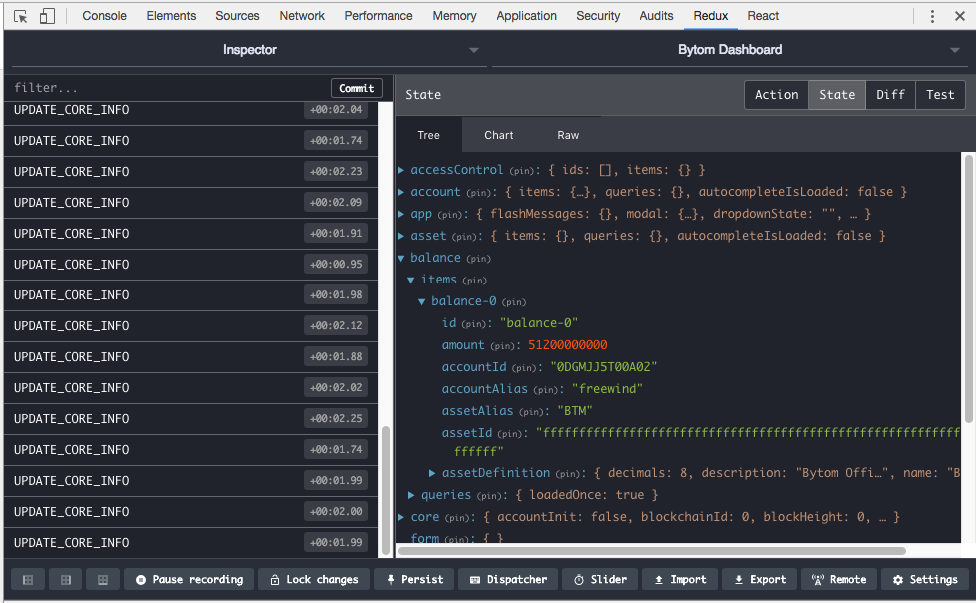

在前几篇里，我们研究了比原是如何通过web api接口来创建密钥、帐户和地址的，今天我们继续看一下，比原是如何显示帐户余额的。

在Dashboard中，左侧有一栏名为"Balances"（余额），点击后，我们可以看到每个帐户当前有多少余额

这又是怎么实现的呢？我们还是和以前一样，把它分成两个部分：

1. 前端是如何向后端发送请求的
2. 后端接收到请求数据后，是如何去查询出帐户余额的

前端是如何向后端发送请求的
----------------------

对应这个功能的前端代码远比想像中复杂，我花了很多功夫才把逻辑理清楚，主要原因是它是一种通用的展示方式：以表格的形式来展示一个数组中多个元素的内容。不过在上图所展示的例子中，这个数组只有一个元素而已。

首先需要提醒的是，这里涉及到[Redux](https://github.com/reactjs/redux)和[Redux-router](https://github.com/acdlite/redux-router)的很多知识，如果不熟悉的话，最好能先去找点文档和例子看看，把里面的一些基本概念弄清楚。比如，

1. 在Redux中，通常会有一个叫`store`的数据结构，像一个巨大的JSON对象，持有整个应用所有需要的数据；
2. 我们需要写很多reducer，它们就是store的转换器，根据当前传入的store返回一个新的内容不同的store，store在不同时刻的内容可以看作不同的state
3. action是用来向reducer传递数据的，reducer将根据action的类型和参数来做不同的转换
4. dispatch是Redux提供的，我们一般不能直接调用reducer，而是调用dispatch，把action传给它，它会帮我们拿到当前的store，并且把它（或者一部分）和action一起传给reducer去做转换
5. redux-router会提供一个`reduxConnect`函数，帮我们把store跟react的组件连接起来，使得我们在React组件中，可以方便的去dispatch

另外，在Chrome中，有两个插件可以方便我们去调试React+Redux：

1. React DevTools: <https://chrome.google.com/webstore/detail/react-developer-tools/fmkadmapgofadopljbjfkapdkoienihi>
2. Redux DevTools: <https://chrome.google.com/webstore/detail/redux-devtools/lmhkpmbekcpmknklioeibfkpmmfibljd>

下面将结合前端源代码来分析一下过程，因为在逻辑上可以看作存在几条线，所以我们将分开追踪。

### reducers

首先我们发现在启动的地方，初始化了`store`：

[src/app.js#L17-L18](https://github.com/freewind/bytom-dashboard-v1.0.0/blob/master/src/app.js#L17-L18)

```js
// Start app
export const store = configureStore()
```

并且在里面创建store的时候，还创建了reducer：

[src/configureStore.js#L13-L37](https://github.com/freewind/bytom-dashboard-v1.0.0/blob/master/src/configureStore.js#L13-L37)

```js
export default function() {
  const store = createStore(
    makeRootReducer(),
    ...

  return store
}
```

进入`makeRootReducer`：

[src/reducers.js#L18-L62](https://github.com/freewind/bytom-dashboard-v1.0.0/blob/master/src/reducers.js#L18-L62)

```js
// ...
import { reducers as balance } from 'features/balances'
// ...
const makeRootReducer = () => (state, action) => {
  // ...
  return combineReducers({
    // ...
    balance,
    // ...
  })(state, action)
}
```

这个函数的最后实际上会把多个组件需要的reducer合并在一起，但是我把其它的都省略了，只留下了今天要研究的`balance`。

而这个balance是来自于`'features/balances'`暴露出来的`reducers`：

[src/features/balances/index.js#L5-L9](https://github.com/freewind/bytom-dashboard-v1.0.0/blob/master/src/features/balances/index.js#L5-L9)

```js
import reducers from './reducers'

export {
  actions,
  reducers,
  routes
}
```

可以看到除了`reducers`，它还暴露了别的，那些我们一会儿再研究。先看`reducers`，它对应于`reducers.js`：

[src/features/balances/reducers.js#L30-L33](https://github.com/freewind/bytom-dashboard-v1.0.0/blob/master/src/features/balances/reducers.js#L30-L33)

```js
export default combineReducers({
  items: itemsReducer,
  queries: queriesReducer
})
```

可以看到，它是把两种作用的reducer合并起来了，一个是跟操作元素相关的，另一个是用来记录查询状态的（是否查询过）。

我们先看元素相关的`itemsReducer`：

[src/features/balances/reducers.js#L3-L17](https://github.com/freewind/bytom-dashboard-v1.0.0/blob/master/src/features/balances/reducers.js#L3-L17)

```js
const itemsReducer = (state = {}, action) => {
  if (action.type == 'APPEND_BALANCE_PAGE') {
    const newState = {}
    action.param.data.forEach((item, index) => {
      const id = `balance-${index}`
      newState[id] = {
        id: `balance-${index}`,
        ...item
      }
    })

    return newState
  }
  return state
}
```

可以看到，当传过来的参数`action`的`type`是`APPEND_BALANCE_PAGE`时，就会把`action.param.data`中包含的元素放到一个新创建的state中，并且以索引顺序给它们起了id，且在id前面加了`balance-`方便追踪。比如我们在Chrome的Redux DevTools插件中就可以看到：



经过这个reducer处理后产生的新store中就包含了与balance相关的数据，它们可以用于在别处拿出来显示在React组件中。这点我们在后面会看到。

再看另一个与查询相关的`queriesReducer`：

[src/features/balances/reducers.js#L19-L27](https://github.com/freewind/bytom-dashboard-v1.0.0/blob/master/src/features/balances/reducers.js#L19-L27)

```js
const queriesReducer = (state = {}, action) => {
  if (action.type == 'APPEND_BALANCE_PAGE') {
    return {
      loadedOnce: true
    }
  }
  return state
}
```

这个比较简单，它关心的`action.type`跟前面一样，也是`APPEND_BALANCE_PAGE`。返回的`loadedOnce`的作用是告诉前端有没有向后台查询过，这样可以用于控制比如提示信息的显示等。

与balance相关的reducer就只有这些了，看起来还是比较简单的。

### actions

在前面，我们看到在balance中除了reducer，还定义了actions：

[src/features/balances/index.js#L5-L9](https://github.com/freewind/bytom-dashboard-v1.0.0/blob/master/src/features/balances/index.js#L5-L9)

```js
import actions from './actions'
// ...

export {
  actions,
  reducers,
  routes
}
```

其中的`actions`对应的是`actions.js`：

[src/features/balances/actions.js#L1-L2](https://github.com/freewind/bytom-dashboard-v1.0.0/blob/master/src/features/balances/actions.js#L1-L2)

```js
import { baseListActions } from 'features/shared/actions'
export default baseListActions('balance')
```

可以看到，它实际上是利用了一个项目内共享的action来产生自己的action，让我们找到`baseListActions`：

[src/features/shared/actions/index.js#L1-L9](https://github.com/freewind/bytom-dashboard-v1.0.0/blob/master/src/features/shared/actions/index.js#L1-L9)

```js
// ...
import baseListActions from './list'

export {
  // ...
  baseListActions,
}
```

继续，先让我们省略掉一些代码，看看骨架：

[src/features/shared/actions/list.js#L4-L147](https://github.com/freewind/bytom-dashboard-v1.0.0/blob/master/src/features/shared/actions/list.js#L4-L147)

```js
// 1. 
export default function(type, options = {}) {

  // 2. 
  const listPath  = options.listPath || `/${type}s`

  // 3. 
  const clientApi = () => options.clientApi ? options.clientApi() : chainClient()[`${type}s`]

  // 4. 
  const fetchItems = (params) => {
    // ...
  }

  const fetchPage = (query, pageNumber = 1, options = {}) => {
    // ...
  }

  const fetchAll = () => {
    // ...
  }

  const _load = function(query = {}, list = {}, requestOptions) {
    // ...
  }

  const deleteItem = (id, confirmMessage, deleteMessage) => {
    // ...
  }

  const pushList = (query = {}, pageNumber, options = {}) => {
    // ...
  }

  // 5.
  return {
    fetchItems,
    fetchPage,
    fetchAll,
    deleteItem,
    pushList,
    didLoadAutocomplete: {
      type: `DID_LOAD_${type.toUpperCase()}_AUTOCOMPLETE`
    },
  }
}
```

这个函数比较大，它是一个通用的用来分页分元素来展示数据的。为了方便理解，我们先把一些细节代码注释掉了，只留下了骨架，并且标注了6块内容：

1. 第1处需要关注的是，这是一个函数，可以被外界调用，所以前面才可以`baseListActions('balance')`，传进来的第一个参数是用来表示这是什么类型的数据，其它地方可以根据这个类型发送不同的请求或进行不同的操作
1. 第2处是定义前台列出数据（就是常用的list页面）的router路径，默认就type的复数，比如`balance`就是`/balances`，它会被redux-router处理，并且转到相应的组件
1. 第3处是找到相应的用于向后台传送数据的对象，名为`clientApi`，封装了后台提供的web api接口
1. 第4处是与显示数据相关的通用函数定义，比如取数据，按页取，删除等
1. 第5处是把前面定义的各种操作函数组合成一个对象，返回给调用者

其实我觉得这些函数的细节在这里都不用怎么展示，因为在代码分析的时候，难度不在一个具体的函数是怎么实现的，而是在于骨架和流程是怎么样的。这里列出了多个函数的名字，我还不清楚哪些会用到，所以先不讲解，等后面遇到了再把代码贴出来讲解。

### routes

再看前面剩下的routes是怎么实现的：

[src/features/balances/index.js#L5-L9](https://github.com/freewind/bytom-dashboard-v1.0.0/blob/master/src/features/balances/index.js#L5-L9)

```js
// ...
import routes from './routes'

export {
  actions,
  reducers,
  routes
}
```

这个`routes`对应的是`routes.js`文件：

[src/features/balances/routes.js#L1-L4](https://github.com/freewind/bytom-dashboard-v1.0.0/blob/master/src/features/balances/routes.js#L1-L4)

```js
import { List } from './components'
import { makeRoutes } from 'features/shared'

export default (store) => makeRoutes(store, 'balance', List)
```

跟前面的action类似，它也是通过调用一个通用的函数再传入一些具体的参数过去实现的，那么在那边的`makeRoutes`肯定做了大量的工作。让我们进入`features/shared/index.js`：

[src/features/shared/index.js#L1-L9](https://github.com/freewind/bytom-dashboard-v1.0.0/blob/master/src/features/shared/index.js#L1-L9)

```js
// ...
import makeRoutes from './routes'
// ...

export {
  actions,
  reducers,
  makeRoutes
}
```

只聚焦于`makeRoutes`：

[src/features/shared/routes.js#L5-L44](https://github.com/freewind/bytom-dashboard-v1.0.0/blob/master/src/features/shared/routes.js#L5-L44)

```js
const makeRoutes = (store, type, List, New, Show, options = {}) => {
  // 1. 
  const loadPage = () => {
    store.dispatch(actions[type].fetchAll())
  }

  // 2.
  const childRoutes = []

  if (New) {
    childRoutes.push({
      path: 'create',
      component: New
    })
  }

  if (options.childRoutes) {
    childRoutes.push(...options.childRoutes)
  }

  if (Show) {
    childRoutes.push({
      path: ':id',
      component: Show
    })
  }

  // 3.
  return {
    path: options.path || type + 's',
    component: RoutingContainer,
    name: options.name || humanize(type + 's'),
    name_zh: options.name_zh,
    indexRoute: {
      component: List,
      onEnter: (nextState, replace) => {
        loadPage(nextState, replace)
      },
      onChange: (_, nextState, replace) => { loadPage(nextState, replace) }
    },
    childRoutes: childRoutes
  }
}
```

分成了4块：

1. 第1处定义了`loadPage`的操作，它实际上要是调用该type对应的action的`fetchAll`方法（还记得前面action骨架中定义了`fetchAll`函数吗）
2. 第2处根据传入的参数来确定这个router里到底有哪些routes，比如是否需要“新建”，“显示”等等
3. 第3处就是返回值，返回了一个对象，它是可以被redux-router理解的。可以看到它里面有`path`, 对应的组件`component`，甚至首页中某些特别时刻如进入或者改变时，要进行什么操作。

由于这里调用了`fetchAll`，那我们便把前面action里的`fetchAll`贴出来：

[src/features/shared/actions/list.js#L58-L60](https://github.com/freewind/bytom-dashboard-v1.0.0/blob/master/src/features/shared/actions/list.js#L58-L60)

```js
  const fetchAll = () => {
    return fetchPage('', -1)
  }
```

又调用到了`fetchPage`：

[src/features/shared/actions/list.js#L39-L55](https://github.com/freewind/bytom-dashboard-v1.0.0/blob/master/src/features/shared/actions/list.js#L39-L55)

```js
  const fetchPage = (query, pageNumber = 1, options = {}) => {
    const listId =  query.filter || ''
    pageNumber = parseInt(pageNumber || 1)

    return (dispatch, getState) => {
      const getFilterStore = () => getState()[type].queries[listId] || {}

      const fetchNextPage = () =>
        dispatch(_load(query, getFilterStore(), options)).then((resp) => {
          if (!resp || resp.type == 'ERROR') return

          return Promise.resolve(resp)
        })

      return dispatch(fetchNextPage)
    }
  }
```

在中间又调用了`_load`：

[src/features/shared/actions/list.js#L62-L101](https://github.com/freewind/bytom-dashboard-v1.0.0/blob/master/src/features/shared/actions/list.js#L62-L101)

```js
  const _load = function(query = {}, list = {}, requestOptions) {
    return function(dispatch) {
      // ...
      // 1.
      if (!refresh && latestResponse) {
        let responsePage
        promise = latestResponse.nextPage()
          .then(resp => {
            responsePage = resp
            return dispatch(receive(responsePage))
          })
          // ...
      } else {
        // 2. 
        const params = {}
        if (query.filter) params.filter = filter
        if (query.sumBy) params.sumBy = query.sumBy.split(',')
        promise = dispatch(fetchItems(params))
      }

      // 3. 
      return promise.then((response) => {
        return dispatch({
          type: `APPEND_${type.toUpperCase()}_PAGE`,
          param: response,
          refresh: refresh,
        })
      })
      // ...
    }
  }
```

这个函数还比较复杂，我进行了适当简化，并且分成了3块：

1. 第1处的`if`分支处理的是第2页的情况。拿到数据后，会通过`receive`这个函数定义了一个action传给`dispatch`进行操作。这个`receive`在前面被我省略了，其实就是定义了一个`type`为`RECEIVED_${type.toUpperCase()}_ITEMS`的action，也就是说，拿到数据后，还需要有另一个地方对它进行处理。我们晚点再来讨论它。
2. 第2处的`else`处理的是查询情况，拿到其中的过滤条件等，传给`fetchItems`函数
3. 第3处的`promise`就是前面两处中的一个，也就是拿到数据后再进行`APPEND_${type.toUpperCase()}_PAGE`的操作

我们从这里并没有看到它到底会向比原后台的哪个接口发送请求，它可能被隐藏在了某个函数中，比如`nextPage`或者`fetchItems`等。我们先看看`nextPage`:

[src/sdk/page.js#L17-L24](https://github.com/freewind/bytom-dashboard-v1.0.0/blob/master/src/sdk/page.js#L17-L24)

```js
  nextPage(cb) {
    let queryOwner = this.client
    this.memberPath.split('.').forEach((member) => {
      queryOwner = queryOwner[member]
    })

    return queryOwner.query(this.next, cb)
  }
```

可以看到它最后调用的是`client`的`query`方法。其中的client对应的是`balanceAPI`：

[src/sdk/api/balances.js#L3-L9](https://github.com/freewind/bytom-dashboard-v1.0.0/blob/master/src/sdk/api/balances.js#L3-L9)

```js
const balancesAPI = (client) => {
  return {
    query: (params, cb) => shared.query(client, 'balances', '/list-balances', params, {cb}),

    queryAll: (params, processor, cb) => shared.queryAll(client, 'balances', params, processor, cb),
  }
}
```

可以看到，`query`最后将调用后台的`/list-balances`接口。

而`fetchItems`最终也调用的是同样的方法：

[src/features/shared/actions/list.js#L15-L35](https://github.com/freewind/bytom-dashboard-v1.0.0/blob/master/src/features/shared/actions/list.js#L15-L35)

```js
const fetchItems = (params) => {
    // ...
    return (dispatch) => {
      const promise = clientApi().query(params)

      promise.then(
        // ...
      )

      return promise
    }
  }
```

所以我们一会儿在分析后台的时候，只需要关注`/list-balances`就可以了。

这里还剩下一点，就是从后台拿到数据后，前端怎么处理，也就是前面第1块和第3块中拿到数据后的操作。

我们先看一下第1处中的`RECEIVED_${type.toUpperCase()}_ITEMS`的action是如何被处理的。通过搜索，发现了：

[src/features/shared/reducers.js#L6-L28](https://github.com/freewind/bytom-dashboard-v1.0.0/blob/master/src/features/shared/reducers.js#L6-L28)

```js
export const itemsReducer = (type, idFunc = defaultIdFunc) => (state = {}, action) => {
  if (action.type == `RECEIVED_${type.toUpperCase()}_ITEMS`) {
    const newObjects = {}

    const data = type.toUpperCase() !== 'TRANSACTION' ? action.param.data : action.param.data.map(data => ({
      ...data,
      id: data.txId,
      timestamp: data.blockTime,
      blockId: data.blockHash,
      position: data.blockIndex
    }));

    (data || []).forEach(item => {
      if (!item.id) { item.id = idFunc(item) }
      newObjects[idFunc(item)] = item
    })
    return newObjects
  } else // ...
  return state
}
```

可以看到，当拿到数据后，如果是“转帐”则进行一些特殊的操作，否则就直接用。后面的操作，也主要是给每个元素增加了一个id，然后放到store里。

那么第3步中的`APPEND_${type.toUpperCase()}_PAGE`呢？我们找到一些通用的处理代码：

[src/features/shared/reducers.js#L34-L54](https://github.com/freewind/bytom-dashboard-v1.0.0/blob/master/src/features/shared/reducers.js#L34-L54)

```js
export const queryCursorReducer = (type) => (state = {}, action) => {
  if (action.type == `APPEND_${type.toUpperCase()}_PAGE`) {
    return action.param
  }
  return state
}

export const queryTimeReducer = (type) => (state = '', action) => {
  if (action.type == `APPEND_${type.toUpperCase()}_PAGE`) {
    return moment().format('h:mm:ss a')
  }
  return state
}

export const autocompleteIsLoadedReducer = (type) => (state = false, action) => {
  if (action.type == `DID_LOAD_${type.toUpperCase()}_AUTOCOMPLETE`) {
    return true
  }

  return state
}
```

这里没有什么复杂的操作，主要是把前面送过来的参数当作store新的state传出去，或者在`queryTimeReducer`是传出当前时间，可以把它们理解为一些占位符（默认值）。如果针对某一个具体类型，还可以定义具体的操作。比如我们这里是`balance`，所以它还会被前面最开始讲解的这个函数处理：

[src/features/balances/reducers.js#L3-L17](https://github.com/freewind/bytom-dashboard-v1.0.0/blob/master/src/features/balances/reducers.js#L3-L17)

```js
const itemsReducer = (state = {}, action) => {
  if (action.type == 'APPEND_BALANCE_PAGE') {
    const newState = {}
    action.param.data.forEach((item, index) => {
      const id = `balance-${index}`
      newState[id] = {
        id: `balance-${index}`,
        ...item
      }
    })

    return newState
  }
  return state
}
```

这个前面已经讲了，这里列出来仅供回忆。

那么到这里，我们基本上就已经把比原前端中，如何通过分页列表形式展示数据的流程弄清楚了。至于拿到数据后，最终如何在页面上以table的形式展示出来，可以参看<https://github.com/freewind/bytom-dashboard-v1.0.0/blob/master/src/features/balances/components/ListItem.jsx>，我觉得这里已经不需要再讲解了。

那么我们准备进入后端。

后端是如何通过`/list-balances`接口查询出帐户余额的
---------------------------------------------

跟之前一样，我们可以很快的找到定义web api接口的地方：

[api/api.go#L164-L244](https://github.com/freewind/bytom-v1.0.1/blob/master/api/api.go#L164-L244)

```go
func (a *API) buildHandler() {
    // ...
    if a.wallet != nil {
        // ...
        m.Handle("/list-balances", jsonHandler(a.listBalances))
        // ...

    // ...
}
```

可以看到，`/list-balances`对应的handler是`a.listBalances`（外面的`jsonHandler`是用于处理http方面的东西，以及在Go对象与JSON之间做转换的）

[api/query.go#L60-L67](https://github.com/freewind/bytom-v1.0.1/blob/master/api/query.go#L60-L67)

```go
// POST /list-balances
func (a *API) listBalances(ctx context.Context) Response {
    balances, err := a.wallet.GetAccountBalances("")
    if err != nil {
        return NewErrorResponse(err)
    }
    return NewSuccessResponse(balances)
}
```

这个方法看起来很简单，因为它不需要前端传入任何参数，然后再调用`wallet.GetAccountBalances`并传入空字符串（表示全部帐户）拿到结果，并且返回给前端即可：

[wallet/indexer.go#L544-L547](https://github.com/freewind/bytom-v1.0.1/blob/master/wallet/indexer.go#L544-L547)

```go
// GetAccountBalances return all account balances
func (w *Wallet) GetAccountBalances(id string) ([]AccountBalance, error) {
    return w.indexBalances(w.GetAccountUTXOs(""))
}
```

这里分成了两步，首先是调用`w.GetAccountUTXOs`得到帐户对应的`UTXO`，然后再根据它计算出来余额balances。

`UTXO`是`Unspent Transaction Output`，是比特币采用的一个概念（在比原链中对它进行了扩展，支持多种资产）。其中`Transaction`可看作是一种数据结构，记录了一个交易的过程，包括若干个资金输入和输出。在比特币中没有我们通常熟悉的银行帐户那样有专门的地方记录余额，而是通过计算属于自己的所有未花费掉的输出来算出余额。关于UTXO网上有很多文章讲解，可以自行搜索。

我们继续看`w.GetAccountUTXOs`：

[wallet/indexer.go#L525-L542](https://github.com/freewind/bytom-v1.0.1/blob/master/wallet/indexer.go#L525-L542)

```go
// GetAccountUTXOs return all account unspent outputs
func (w *Wallet) GetAccountUTXOs(id string) []account.UTXO {
    var accountUTXOs []account.UTXO

    accountUTXOIter := w.DB.IteratorPrefix([]byte(account.UTXOPreFix + id))
    defer accountUTXOIter.Release()
    for accountUTXOIter.Next() {
        accountUTXO := account.UTXO{}
        if err := json.Unmarshal(accountUTXOIter.Value(), &accountUTXO); err != nil {
            hashKey := accountUTXOIter.Key()[len(account.UTXOPreFix):]
            log.WithField("UTXO hash", string(hashKey)).Warn("get account UTXO")
        } else {
            accountUTXOs = append(accountUTXOs, accountUTXO)
        }
    }

    return accountUTXOs
}
```

这个方法看起来不是很复杂，它主要是从数据库中搜索`UTXO`，然后返回给调用者继续处理。这里的`w.DB`是指名为`wallet`的leveldb，我们这段时间一直在用它。初始化的过程今天就不看了，之前做过多次，大家有需要的话应该能自己找到。

然后就是以`UTXOPreFix`（常量`ACU:`，表示`StandardUTXOKey prefix`）作为前缀对数据库进行遍历，把取得的JSON格式的数据转换为`account.UTXO`对象，最后把它们放到数组里返回给调用者。

我们再看前面`GetAccountBalances`方法中的`w.indexBalances`：

[wallet/indexer.go#L559-L609](https://github.com/freewind/bytom-v1.0.1/blob/master/wallet/indexer.go#L559-L609)

```go
func (w *Wallet) indexBalances(accountUTXOs []account.UTXO) ([]AccountBalance, error) {
    // 1. 
    accBalance := make(map[string]map[string]uint64)
    balances := make([]AccountBalance, 0)

    // 2.
    for _, accountUTXO := range accountUTXOs {
        assetID := accountUTXO.AssetID.String()
        if _, ok := accBalance[accountUTXO.AccountID]; ok {
            if _, ok := accBalance[accountUTXO.AccountID][assetID]; ok {
                accBalance[accountUTXO.AccountID][assetID] += accountUTXO.Amount
            } else {
                accBalance[accountUTXO.AccountID][assetID] = accountUTXO.Amount
            }
        } else {
            accBalance[accountUTXO.AccountID] = map[string]uint64{assetID: accountUTXO.Amount}
        }
    }

    // 3. 
    var sortedAccount []string
    for k := range accBalance {
        sortedAccount = append(sortedAccount, k)
    }
    sort.Strings(sortedAccount)

    for _, id := range sortedAccount {
        // 4.
        var sortedAsset []string
        for k := range accBalance[id] {
            sortedAsset = append(sortedAsset, k)
        }
        sort.Strings(sortedAsset)

        // 5.
        for _, assetID := range sortedAsset {
            alias := w.AccountMgr.GetAliasByID(id)
            targetAsset, err := w.AssetReg.GetAsset(assetID)
            if err != nil {
                return nil, err
            }

            assetAlias := *targetAsset.Alias
            balances = append(balances, AccountBalance{
                Alias: alias,
                AccountID: id,
                AssetID: assetID,
                AssetAlias: assetAlias,
                Amount: accBalance[id][assetID],
                AssetDefinition: targetAsset.DefinitionMap,
            })
        }
    }

    return balances, nil
}
```

这个方法看起来很长，但是实际上做的事情没那么多，只不过是因为Go低效的语法让它看起来非常庞大。我把它分成了5块：

1. 第1块分别定义了后面要用到的一些数据结构，其中`accBalance`是一个两级的map（AccountID -> AssetID -> AssetAmount），通过对参数`accountUTXOs`进行遍历，把相同account和相同asset的数量累加在一起。`balances`是用来保存结果的，是一个`AccountBalance`的切片
2. 第2块就是累加assetAmount，放到`accBalance`中
3. 对accountId进行排序，
4. 对assetId也进行排序，这两处的排序是想让最后的返回结果稳定（有利于查看及分页）
5. 经过双层遍历，拿到了每一个account的每一种asset的assetAmount，然后再通过`w.AccountMgr.GetAliasByID`拿到缺少的`alias`信息，最后生成一个切片返回。其中`GetAliasByID`就是从`wallet`数据库中查询，比较简单，就不贴代码了。

看完这一段代码之后，我的心情是比较郁闷的，因为这里的代码看着多，但实际上都是一些比较低层的逻辑（构建、排序、遍历），在其它的语言中（尤其是支持函数式的），可能只需要十来行代码就能搞定，但是这么要写这么多。而且，我还发现，GO语言通过它独特的语法、错误处理和类型系统，让一些看起来应该很简单的事情（比如抽出来一些可复用的处理数据结构的函数）都变得很麻烦，我试着重构，居然发现无从下手。

今天的问题就算是解决了，下次再见。

---

如果你觉得这些文章对你非常有用，控制不住想打赏作者，可以有以下选择：

1. BTM: `0x6bcCfb7265d4aB0C1a71F7d19b9E581cae73D777`
2. BTC: `1Af2Q23Y1kqgtgbryzjS7RxrnEmyvYuX4b`
3. ETH: `0x6bcCfb7265d4aB0C1a71F7d19b9E581cae73D777`

多少请随意，心意最重要，我们一起努力吧！