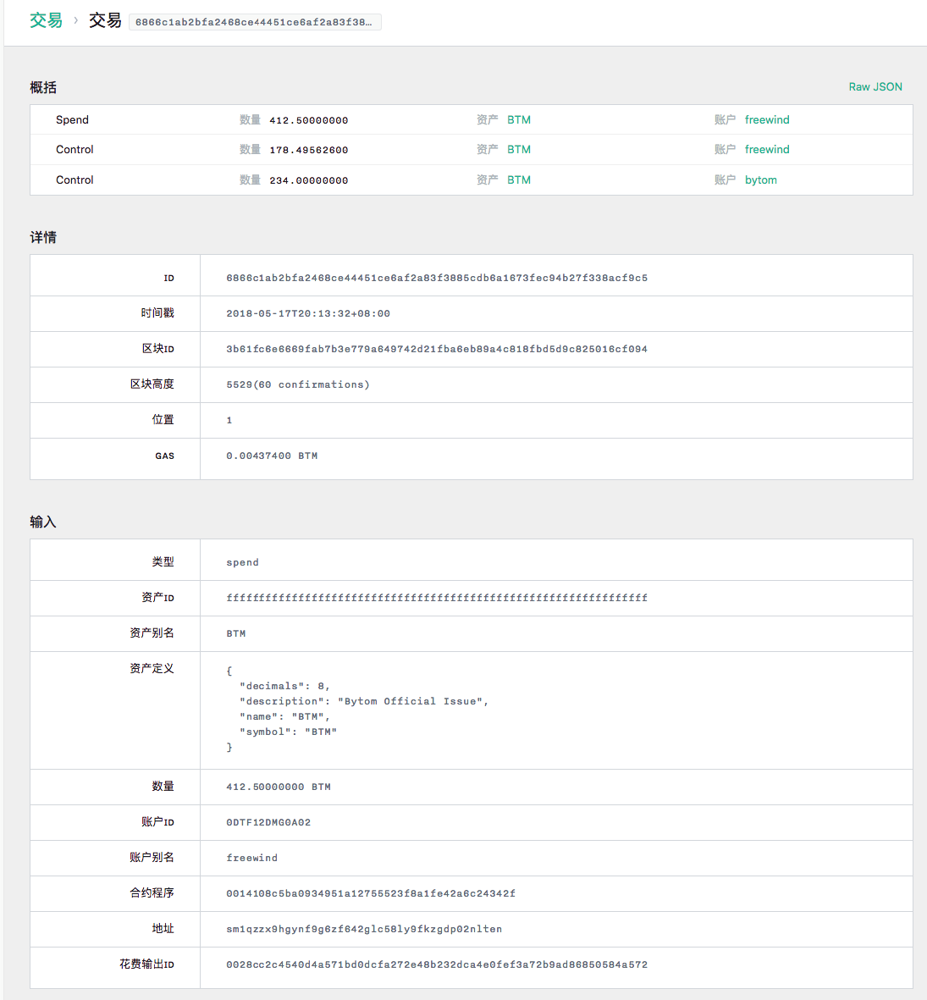

在上上篇文章里，我们还剩下一个小问题没有解决，即前端是如何显示一个交易的详细信息的。

先看对应的图片：




这个图片由于太长，分成了两个，实际上可以看作一个。

那么这个页面是怎么来的呢？这是在前面以列表的方式显示交易摘要信息后，可以点击摘要信息右上角的“查看详情”链接打开。

那我们在本文看一下，比原是如何显示这个交易的详细信息的。

由于它分成了前后两端，那么我们跟以前一样，把它再分成两个小问题：

1. 前端是怎么向后台发送请求，并显示数据的
2. 后端是如何拿到相应的数据发送给前台的

需要说明的是，这个表格中包含了很多信息，但是我们在本文并不打算去解释。因为能看懂的一看就能明白，看不懂的就需要准确的了解了比原的核心之后才能解释清楚，而这一块等到我们晚点再专门研究。

前端是怎么向后台发送请求，并显示数据的
--------------------------------

首先我们看一下显示交易详细信息页面的路由path是多少。当我们把鼠标放在交易摘要页面右上角的“查看详情”时，会发现url类似于：

```
http://localhost:9888/dashboard/transactions/2d94709749dc59f69cad4d6aea666586d9f7e86b96c9ee81d06f66d4afb5d6dd
```

其中`http://localhost:9888/dashboard/`可以看作是这个应用的根路径，那么路由path应该就是`/transactions/2d94709749dc59f69cad4d6aea666586d9f7e86b96c9ee81d06f66d4afb5d6dd`，后面那么长的显然是一个id，所以我们应该到代码中寻找类似于`/transactions/:id`这样的字符串，哦，遗憾的是没有找到。。。

那只能从头开始了，先找到前端路由的定义：

[src/routes.js#L15-L35](https://github.com/freewind/bytom-dashboard-v1.0.0/blob/master/src/routes.js#L15-L35)

```js
// ...
import { routes as transactions } from 'features/transactions'

// ...

const makeRoutes = (store) => ({
  path: '/',
  component: Container,
  childRoutes: [
    // ...
    transactions(store),
    // ...
  ]
})
```

其中的`transactions`就是我们需要的，而它对应了`features/transactions/routes.js`：

[src/features/transactions/routes.js#L1-L21](https://github.com/freewind/bytom-dashboard-v1.0.0/blob/master/src/features/transactions/routes.js#L1-L21)

```js
import { List, New, AssetShow, AssetUpdate } from './components'
import { makeRoutes } from 'features/shared'

export default (store) => {
  return makeRoutes(
    store,
    'transaction',
    List,
    New,
    Show,
    // ...
  )
}
```

这个函数将会为`transactions`生成很多相关的路由路径。当我们把一些组件，比如列表显示`List`，新建`New`，显示详情`Show`等等传进去之后，`makeRoutes`就会按照预先定义好的路径规则去添加相关的path。我们看一下`makeRoutes`：

[src/features/shared/routes.js#L1-L44](https://github.com/freewind/bytom-dashboard-v1.0.0/blob/master/src/features/shared/routes.js#L1-L44)

```js
import { RoutingContainer } from 'features/shared/components'
import { humanize } from 'utility/string'
import actions from 'actions'

const makeRoutes = (store, type, List, New, Show, options = {}) => {
  const loadPage = () => {
    store.dispatch(actions[type].fetchAll())
  }

  const childRoutes = []

  if (New) {
    childRoutes.push({
      path: 'create',
      component: New
    })
  }

  if (options.childRoutes) {
    childRoutes.push(...options.childRoutes)
  }

  // 1. 
  if (Show) {
    childRoutes.push({
      path: ':id',
      component: Show
    })
  }

  return {
    // 2.    
    path: options.path || type + 's',
    component: RoutingContainer,
    name: options.name || humanize(type + 's'),
    name_zh: options.name_zh,
    indexRoute: {
      component: List,
      onEnter: (nextState, replace) => {
        loadPage(nextState, replace)
      },
      onChange: (_, nextState, replace) => { loadPage(nextState, replace) }
    },
    childRoutes: childRoutes
  }
}
```

这段代码看起来眼熟，因为我们在之前研究余额和交易的列表显示的时候，都见过它。而我们今天关注的是`Show`，即标记为第1处的代码。

可以看到，当传进来了`Show`组件时，就需要为其生成相关的路由path。具体是在`childRouters`中添加一个`path`为`:id`，而它本身的路由path是在第2处定义的，默认为`type + 's'`，而对于本例来说，`type`的值就是`transaction`，所以`Show`所对应的完整path就是`/transactions/:id`，正是我们所需要的。

再回到第1处代码，可以看到`Show`组件是从外部传进来的，从前面的函数可以看到它对应的是`src/features/transactions/components/Show.jsx`。

我们进去看一下这个`Show.jsx`，首先是定义html组件的函数`render`：

[src/features/transactions/components/Show.jsx#L16-L96](https://github.com/freewind/bytom-dashboard-v1.0.0/blob/master/src/features/transactions/components/Show.jsx#L16-L96)

```js
class Show extends BaseShow {

  render() {
    // 1.
    const item = this.props.item
    const lang = this.props.lang
    const btmAmountUnit = this.props.btmAmountUnit

    let view
    if (item) {
      // ..
      view = <div>
        <PageTitle title={title} />

        <PageContent>
          // ...

          <KeyValueTable
            title={lang === 'zh' ? '详情' : 'Details'}
            items={[
              // ...
            ]}
          />

          {item.inputs.map((input, index) =>
            <KeyValueTable
              // ...
            />
          )}

          {item.outputs.map((output, index) =>
            <KeyValueTable
              // ...
            />
          )}
        </PageContent>
      </div>
    }

    return this.renderIfFound(view)
  }
}
```

代码被我进行了大量的简化，主要是省略了很多数据的计算和一些显示组件的参数。我把代码分成了2部分：

1. 第1处需要注意的是类似于`const item = this.props.item`这样的代码，这里的`item`就是我们要展示的数据，对应本文就是一个`transaction`对象，它是从`this.props`中拿到的，所以我们可以推断在这个文件（或者引用的某个文件）中，会有一个`connect`方法，把store里的数据塞过来。一会儿我们去看看。后面两行类似就不说了。
2. 第2处代码主要就是页面view的定义了，可以看到里面主要是用到了另一个自定义组件`KeyValueTable`。代码我们就不跟过去了，参照前面的页面效果我们可以想像出来它就是以表格的形式把一些key-value数据显示出来。

那我们继续去寻找`connect`，很快就在同一个页面的后面，找到了如下的定义：

[src/features/transactions/components/Show.jsx#L100-L117](https://github.com/freewind/bytom-dashboard-v1.0.0/blob/master/src/features/transactions/components/Show.jsx#L100-L117)

```js
import { actions } from 'features/transactions'
import { connect } from 'react-redux'

const mapStateToProps = (state, ownProps) => ({
  item: state.transaction.items[ownProps.params.id],
  lang: state.core.lang,
  btmAmountUnit: state.core.btmAmountUnit,
  highestBlock: state.core.coreData && state.core.coreData.highestBlock
})

// ...

export default connect(
  mapStateToProps,
  // ...
)(Show)
```

我只留下了需要关注的`mapStateToProps`。可以看到，我们在前面第1处中看到的几个变量的赋值，在这里都有定义，其中最重要的`item`，是从store的当前状态`state`中的`transaction`中的`items`中取出来的。

那么`state.transaction`是什么呢？我开始以为它是我们从后台取回来的一些数据，使用`transaction`这个名字放到了store里，结果怎么都搜不到，最后终于发现原来不是的。

实际情况是，在我们定义reducer的地方，有一个`makeRootReducer`：

[src/reducers.js#L1-L62](https://github.com/freewind/bytom-dashboard-v1.0.0/blob/master/src/reducers.js#L1-L62)

```js
// ...
import { reducers as transaction } from 'features/transactions'
// ...

const makeRootReducer = () => (state, action) => {
  // ...
  return combineReducers({
    // ...
    transaction,
    // ...
  })(state, action)
}
```

原来它是在这里构建出来的。首先`{ transaction }`这种ES6的语法，换成平常的写法，就是：

```js
{
  transaction: transaction
}
```

另外，`combineReducers`这个方法，是用来把多个reducer合并起来（可能是因为store太大，所以把它拆分成多个reducer管理，每个reducer只需要处理自己感兴趣的部分），并且合并以后，这个store就会变成大概这样：

```js
{
    "transaction": { ... },
    // ...
}
```

所以前面的`state.transaction`就是指的这里的`{ ... }`。

那么继续，在前面的代码中，可以从`state.transaction.items[ownProps.params.id]`看到，`state.transaction`还有一个`items`的属性，它持有的是向后台`/list-transactions`取回的一个transaction数组，它又是什么时候加上去的呢？

这个问题难倒了我，我花了几个小时搜遍了比原的前后端仓库，都没找到，最后只好使出了Chrome的Redux DevTools大法，发现在一开始的时候，`items`就存在了：


在图上有两个红框，左边的表示我现在选择的是初始状态，右边显示最开始`transaction`就已经有了`items`，于是恍然大悟，这不跟前面是一样的道理嘛！于是很快找到了定义：

[src/features/transactions/reducers.js#L7-L16](https://github.com/freewind/bytom-dashboard-v1.0.0/blob/master/src/features/transactions/reducers.js#L7-L16)

```js
export default combineReducers({
  items: reducers.itemsReducer(type),
  queries: reducers.queriesReducer(type),
  generated: (state = [], action) => {
    if (action.type == 'GENERATED_TX_HEX') {
      return [action.generated, ...state].slice(0, maxGeneratedHistory)
    }
    return state
  },
})
```

果然，这里也是用`combineReducers`把几个reducer组合在了一起，所以store里就会有这里的几个key，包括`items`，以及我们不关心的`queries`和`generated`。

花了一下午，终于把这块弄清楚了。看来对于分析动态语言，一定要脑洞大开，不能预设原因，另外要利用各种调试工具，从不同的角度去查看数据。要不是Redux的Chrome插件，我不知道还要卡多久。

我个人更喜欢静态类型的语言，对于JavaScript这种，除非万不得以，能躲就躲，主要原因就是代码中互相引用的线索太少了，很多时候必须看文档、代码甚至去猜，无法利用编辑器提供的跳转功能。

知道了`state.transaction.items`的来历以后，后面的事情就好说了。我们是从`state.transaction.items[ownProps.params.id]`拿到了当前需要的transaction，那么`state.transaction.items`里又是什么时候放进去数据的呢？

让我们再回到前面的`makeRoutes`：

[src/features/shared/routes.js#L1-L44](https://github.com/freewind/bytom-dashboard-v1.0.0/blob/master/src/features/shared/routes.js#L1-L44)

```js
// ...
import actions from 'actions'

const makeRoutes = (store, type, List, New, Show, options = {}) => {
  // 2.
  const loadPage = () => {
    store.dispatch(actions[type].fetchAll())
  }

  // ...

  return {
    path: options.path || type + 's',
    component: RoutingContainer,
    name: options.name || humanize(type + 's'),
    name_zh: options.name_zh,
    indexRoute: {
      component: List,
      onEnter: (nextState, replace) => {
        loadPage(nextState, replace)
      },
      // 1. 
      onChange: (_, nextState, replace) => { loadPage(nextState, replace) }
    },
    childRoutes: childRoutes
  }
}
```

在上面的第1处，对于`indexRoute`，有一个`onChange`的触发器。它的意思是，当路由的path改变了，并且新的path属于当前的这个index路由的path（或者子path），后面的函数将会触发。而后面函数中的`loadPage`的定义在第2处代码，它又会将`actions[type].fetchAll()`生成的action进行dispatch。由于`type`在本文中是`transaction`，通过一步步追踪（这里稍有点麻烦，不过我们在之前的文章中已经走过），我们发现`actions[type].fetchAll`对应了`src/features/shared/actions/list.js`：

[src/features/shared/actions/list.js#L4-L147](https://github.com/freewind/bytom-dashboard-v1.0.0/blob/master/src/features/shared/actions/list.js#L4-L147)

```js
export default function(type, options = {}) {
  const listPath  = options.listPath || `/${type}s`
  const clientApi = () => options.clientApi ? options.clientApi() : chainClient()[`${type}s`]

  // ...

  const fetchAll = () => {
    // ...
  }

  // ...

  return {
    // ...
    fetchAll,
    // ...
  }
}
```

如果我们还对这一段代码有印象的话，就会知道它最后将会去访问后台的`/list-transactions`，并在拿到数据后调用`dispatch("RECEIVED_TRANSACTION_ITEMS")`，而它将会被下面的这个reducer处理：

[src/features/shared/reducers.js#L6-L28](https://github.com/freewind/bytom-dashboard-v1.0.0/blob/master/src/features/shared/reducers.js#L6-L28)

```js
export const itemsReducer = (type, idFunc = defaultIdFunc) => (state = {}, action) => {
  if (action.type == `RECEIVED_${type.toUpperCase()}_ITEMS`) {
    // 1.
    const newObjects = {}

    // 2.
    const data = type.toUpperCase() !== 'TRANSACTION' ? action.param.data : action.param.data.map(data => ({
      ...data,
      id: data.txId,
      timestamp: data.blockTime,
      blockId: data.blockHash,
      position: data.blockIndex
    }));

    // 3. 
    (data || []).forEach(item => {
      if (!item.id) { item.id = idFunc(item) }
      newObjects[idFunc(item)] = item
    })
    return newObjects
  }
  // ...

  return state
}
```

依次讲解这个函数中的三处代码：

1. 第1处是创建了一个新的空对象`newObjects`，它将在最后替代`state.transaction.items`，后面会向它里面赋值
2. 第2处是对传进来的数据进行一些处理，如果type是`transaction`的话，会把数组中每个元素中的某些属性提升到根下，方便使用
3. 第3处就是把各个元素放到`newObjects`中，`id`为key，对象本身为value

经过这些处理以后，我们才能使用`state.transaction.items[ownProps.params.id]`拿到合适的transaction对象，并且由`Show.jsx`显示。

前端这块基本上弄清楚了。我们继续看后端

后端是如何拿到相应的数据发送给前台的
------------------------------

前面我们说过，根据以往的经验，我们可以推导出前端会访问后端的`/list-transactions`这个接口。我们欣喜的发现，这个接口我们正好在前一篇文章中研究过，这里就可以完全跳过了。

到今天为止，我们终于把“比原是如何创建一个交易的”这件事的基本流程弄清楚了。虽然还有很多细节，以及触及到核心的知道都被忽略了，但是感觉自己对于比原内部的运作似乎又多了一些。

也许现在积累的知识差不多了，该向比原的核心进发了。在下一篇，我将会尝试理解和分析比原的核心，在学习的过程中，可能会采用跟目前探索流程分解问题不同的方式。另外，可能前期会花不少时间，所以下一篇出来得会晚一些。当然，如果失败了，说明我目前积累的知识还是不够，我还需要再回到当前的做法，想办法再从不同的地方多剥一些比原的外壳，然后再尝试。


---

如果你觉得这些文章对你非常有用，控制不住想打赏作者，可以有以下选择：

1. BTM: `0x6bcCfb7265d4aB0C1a71F7d19b9E581cae73D777`
2. BTC: `1Af2Q23Y1kqgtgbryzjS7RxrnEmyvYuX4b`
3. ETH: `0x6bcCfb7265d4aB0C1a71F7d19b9E581cae73D777`

多少请随意，心意最重要，我们一起努力吧！