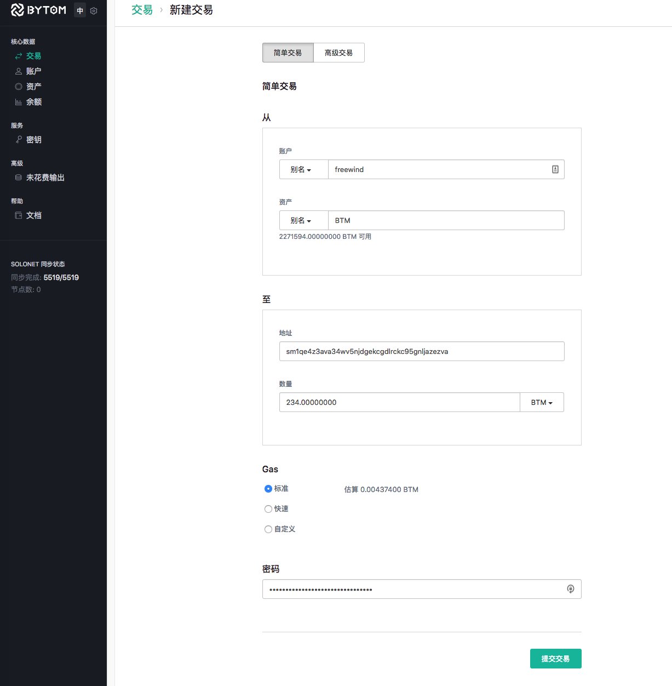
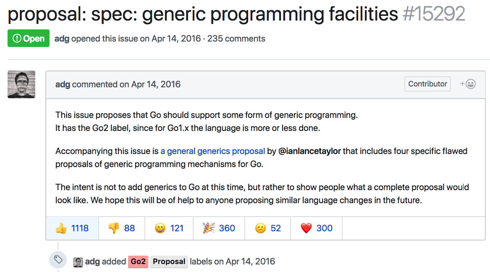

在前面几篇中，我们做了足够了准备，现在终于可以试一试转帐功能了！

这里的转帐最好使用`solonet`，再按前一篇文章的办法修改代码后产生单机测试币，然后再试。在此之前，如果需要的话，请先备份好你之前的帐户，然后删除（或重命名）你的数据目录，再使用`bytomd init --chain_id=solonet`重新初始化。

下面是我通过dashboard进行的转帐操作，在操作之前，我先建立了两个帐户，然后把钱从一个帐户转到另一个帐户的地址中：

新建一个交易，填上把哪个帐户的哪种资产转到某个地址上。可以看到还要消耗一定的gas：



（上图为图1）

转帐成功后，如下：


（上图为图2）

我们看一下这个交易的详细信息，由于太长，截成了两个图：


（上面两图合称为图3）

我们今天（以及往后的几天）就是把这一块流程搞清楚。

由于上面展示的操作还是有点多的，所以我们还是按之前的套路，先把它分解成多个小问题，一一解决：

1. 图1中，转帐界面是如何把转帐数据提交到后台的?
2. 图1中，后台是如何接收到转帐数据并执行转帐操作的？
3. 图2中，前台是如何拿到后台的数据并展示出来的？
4. 图3中，前台是如何拿到后台的数据并展示出来的？

今天的文章，我们主要是研究前两个问题，即跟图1相关的逻辑。

图1中，转帐表单是如何把转帐数据提交到后台的?
-------------------------------------

由于是前端，所以我们要去从前端的代码库中寻找。通过搜索“简单交易”这个词，我们很快定位到下面这块代码：

[src/features/transactions/components/New/New.jsx#L275-L480](https://github.com/freewind/bytom-dashboard-v1.0.0/blob/master/src/features/transactions/components/New/New.jsx#L275-L480)

```js
    return (
      <FormContainer onSubmit={handleSubmit(this.submitWithValidation)}>
      // ...
      </FormContainer>
    )

```

由于上面的代码实在太长太细节，全是一些jsx用于生成表单的代码，我们就跳过算了，有兴趣的同学可以自行看细节。我们需要关注的是，当我们单击了“提交交易”的按钮以后，`this.submitWithValidation`会被调用，而它对应的代码是：

[src/features/transactions/components/New/New.jsx#L159-L177](https://github.com/freewind/bytom-dashboard-v1.0.0/blob/master/src/features/transactions/components/New/New.jsx#L159-L177)

```js
  submitWithValidation(data) {
    return new Promise((resolve, reject) => {
      this.props.submitForm(Object.assign({}, data, {state: this.state}))
        .catch((err) => {
          // ...
          return reject(response)
        })
    })
  }
```

通常我们应该会在这个函数里找到一些线索，发现数据会提交到后台哪个接口。但是这次却好像没有有用的信息，只有一个来自于`props`的看起来非常通用的`submitForm`。看来需要多找找线索。

好在很快在同一个文件的最后面，看到了用于把React组件与Redux连接起来的代码，非常有用：

[src/features/transactions/components/New/New.jsx#L515-L572](https://github.com/freewind/bytom-dashboard-v1.0.0/blob/master/src/features/transactions/components/New/New.jsx#L515-L572)

```js
export default BaseNew.connect(
  (state) => {
    // ...
    return {
      // ...
    }
  },
  (dispatch) => ({
    // ...
    ...BaseNew.mapDispatchToProps('transaction')(dispatch)
  }),
  // ...
  )(Form)
)
```

我把不太关注的内容都省略了，需要关注的是`BaseNew.mapDispatchToProps('transaction')(dispatch)`这一行。

为什么要关注`mapDispatchToProps`这个方法呢？这是因为当我们点击了表单中的提交按钮后，不论中间怎么操作，最后一定要调用`dispatch`来处理某个action。而在前面看到，点击“提交交易”后，执行的是`this.props.submitForm`，通过`this.props.`可以看出，这个`submitForm`是从外部传进来的，而`mapDispatchToPros`就是把dispatch操作映射在`props`上，让`props`中有我们需要的函数。所以如果我们不能从其它地方看到明显的线索的时候，应该考虑去看看这个。

而`BaseNew.mapDispatchToProps`是来自于`BaseNew`，我们又找到了相应的代码：

[src/features/shared/components/BaseNew.jsx#L9-L16](https://github.com/freewind/bytom-dashboard-v1.0.0/blob/master/src/features/shared/components/BaseNew.jsx#L9-L16)

```js
import actions from 'actions'

// ...

export const mapDispatchToProps = (type) => (dispatch) => ({
  submitForm: (data) => {
    return dispatch(actions[type].submitForm(data)).then((resp) => {
      dispatch(actions.tutorial.submitTutorialForm(data, type))
      return resp
    })
  }
})
```

果然在里面找到了`submitForm`的定义。在里面第一个`dispatch`处，传入了参数`actions[type].submitForm(data)`，这里的`type`应该是`transaction`，而`actions`应该是之前某处定义的各种action的集合。

根据`import actions from 'actions'`，我们发现`from`后面的`'actions'`不是相对路径，那么它对应的就是js的源代码根目录`src`下的某个文件，比如`actions.js`。

找到后打开一看，里面果然有`transaction`：

[src/actions.js#L15-L29](https://github.com/freewind/bytom-dashboard-v1.0.0/blob/master/src/actions.js#L15-L29)

```js
// ...
import { actions as transaction } from 'features/transactions'
// ...

const actions = {
  // ...
  transaction,
  // ...
}
```

我们继续进入`features/transactions/`探索，很快找到：

[src/features/transactions/actions.js#L100-L200](https://github.com/freewind/bytom-dashboard-v1.0.0/blob/master/src/features/transactions/actions.js#L100-L200)

```js
form.submitForm = (formParams) => function (dispatch) {
  // ...
  // 2.
  const buildPromise = connection.request('/build-transaction', {actions: processed.actions})

  const signAndSubmitTransaction = (transaction, password) => {
    // 4. 
    return connection.request('/sign-transaction', {
      password,
      transaction
    }).then(resp => {
      if (resp.status === 'fail') {
        throw new Error(resp.msg)
      }

      const rawTransaction = resp.data.transaction.rawTransaction
      // 5. 
      return connection.request('/submit-transaction', {rawTransaction})
    }).then(dealSignSubmitResp)
  }
  // ...
  if (formParams.submitAction == 'submit') {
    // 1. 
    return buildPromise
      .then((resp) => {
        if (resp.status === 'fail') {
          throw new Error(resp.msg)
        }
        // 3.
        return signAndSubmitTransaction(resp.data, formParams.password)
      })
  }
  // ...
}
```

上面的代码经过了我的简化，其实它本来是有很多分支的（因为表单中除了“简单交易”还有“高级交易”等情况）。即使如此，也可以看出来这个过程还是比较复杂的，经过了好几次的后台接口访问：

1. 第1处代码就是对应我们“简单交易”的情况，它会调用`buildPromise`，这里面应该包括了对后台的访问
2. 第2处就是`buildPromise`的定义，可以看到会访问`/build-transaction`
3. 第3处是如果前一个访问是正常的，那么会继续调用`signAndSubmitTransaction`
4. 第4处就进入到`signAndSubmitTransaction`内部了，可以看到，它会访问一个新的接口`/sign-transaction`
5. 第5处是在前一个正常的情况下，进行最后的提交，访问接口`/submit-transaction`。后面的`dealSignSubmitResp`是一些对前端的操作，所以就不看它了

可以看到，这一个表单的提交，在内部对应着好几个接口的访问，每个提交的数据也不一样，代码跟踪起来不太方便。但是好在只要我们知道了这一条主线，那么寻找其它的信息就会简单一些。不过我们也没有必要执着于全部从源代码中找到答案，因为我们的目的并不是学习React/Redux，而是理解比原的逻辑，所以我们可以借助别的工具（比如Chrome的Developer Tools），来捕获请求的数据，从而推理出逻辑。

我已经从Chrome的开发工具中取得了前端向下面几个接口发送的数据：

- `/build-transaction` 
- `/sign-transaction`
- `/submit-transaction`

但是由于我们在这个小问题中，关注的重点是前端如何把数据提交给后台的，所以对于这里提交的数据的意义暂时不讨论，留待下个小问题中一一解答。

图1中，后台是如何接收到转帐数据并执行转帐操作的？
----------------------------------------

由于在图1中前端一共访问了3个不同的后端接口，所以在这里我们就需要依次分开讨论。

### `/build-transaction` 

下面是我通过Chrome的开发工具捕获的数据，看起来还比较多：

`/build-transaction`

#### 提交的数据：

```json
{
    "actions": [{
        "amount": 437400,
        "type": "spend_account",
        "receiver": null,
        "account_alias": "freewind",
        "account_id": "",
        "asset_alias": "BTM",
        "reference_data": null
    }, {
        "amount": 23400000000,
        "type": "spend_account",
        "receiver": null,
        "account_alias": "freewind",
        "account_id": "",
        "asset_alias": "BTM",
        "asset_id": "",
        "reference_data": null
    }, {
        "address": "sm1qe4z3ava34wv5njdgekcgdlrckc95gnljazezva",
        "amount": 23400000000,
        "type": "control_address",
        "receiver": null,
        "asset_alias": "BTM",
        "asset_id": "",
        "reference_data": null
    }]
}
```

可以看到前端向`/build-transaction`发送的数据包含了三个元素，其中前两个是来源帐户的信息，第三个是目的帐户地址。这三个元素都包含一个叫`amount`的key，它的值对应的是相应资产的数量，如果是`BTM`的话，这个数字就需要从右向左数8位，再加上一个小数点。也就是说，第一个amount对应的是`0.00437400`个BTM，第二个是`234.00000000`，第三个是`234.00000000`。

第一个元素对应的费用是gas，也就是图1中显示出来的估算的手续费。第二个是要从相应帐户中转出`234`个BTM，第三个是要转入`234`个BTM。

另外，前两个的`type`是`spend_account`，表明了是帐户，但是`spend`是什么意思目前还不清楚（TODO）；第三个是`control_address`，表示是一个地址。

通过这些数据，比原的后台就知道该怎么做了。

#### 得到的回应：

```json
{
    "status": "success",
    "data": {
        "raw_transaction": "070100010161015f643bef0936443042ccb1e94213
        ed52af72488088702d88e7fc3580359a19a522ffffffffffffffffffffffff
        ffffffffffffffffffffffffffffffffffffffff8099c4d599010001160014
        108c5ba0934951a12755523f8a1fe42a6c24342f010002013dffffffffffff
        ffffffffffffffffffffffffffffffffffffffffffffffffffffe8ebaabf42
        01160014b111c8114dc7ee02050598022b46855fd482d27300013dffffffff
        ffffffffffffffffffffffffffffffffffffffffffffffffffffffff80d4fe
        955701160014cd451eb3b1ab9949c9a8cdb086fc78b60b444ff200",
        "signing_instructions": [{
            "position": 0,
            "witness_components": [{
                "type": "raw_tx_signature",
                "quorum": 1,
                "keys": [{
                    "xpub": "f98b3a39b4eef67707cac85240ef07235c990301b
                    2e0658001545bdb7fde3a21363a23682a1dfbb727dec756562
                    4812c314ca9f31a7f7374101e0247d05cb248",
                    "derivation_path": ["010100000000000000", "0100000000000000"]
                }],
                "signatures": null
            }, {
                "type": "data",
                "value": "b826dcccff76d19d097ca207e053e67d67e3da3a90896ae9fa2d984c6f36d16c"
            }]
        }],
        "allow_additional_actions": false
    }
}
```

这个回应信息是什么意思呢？我们现在开始研究。

我们在比原的后端代码库中，通过查找`/build-transaction`，很快找到了它的定义处：

[api/api.go#L164-L244](https://github.com/freewind/bytom-v1.0.1/blob/master/api/api.go#L164-L244)

```go
func (a *API) buildHandler() {
    // ...
    if a.wallet != nil {
        // ...
        m.Handle("/build-transaction", jsonHandler(a.build))
        // ...
}
```

可以看到它对就的方法是`a.build`，其代码为：

[api/transact.go#L167-L176](https://github.com/freewind/bytom-v1.0.1/blob/master/api/transact.go#L167-L176)

```go
func (a *API) build(ctx context.Context, buildReqs *BuildRequest) Response {
    subctx := reqid.NewSubContext(ctx, reqid.New())

    tmpl, err := a.buildSingle(subctx, buildReqs)
    if err != nil {
        return NewErrorResponse(err)
    }

    return NewSuccessResponse(tmpl)
}
```

其中的`buildReqs`就对应着前端提交过来的参数，只不过被`jsonHandler`自动转成了Go代码。其中`BuildRequest`是这样定义的：

[api/request.go#L21-L26](https://github.com/freewind/bytom-v1.0.1/blob/master/api/request.go#L21-L26)

```go
type BuildRequest struct {
    Tx        *types.TxData            `json:"base_transaction"`
    Actions   []map[string]interface{} `json:"actions"`
    TTL       json.Duration            `json:"ttl"`
    TimeRange uint64                   `json:"time_range"`
}
```

可以看出来有一些字段比如`base_transaction`, `ttl`, `time_range`等在本例中并没有提交上来，它们应该是可选的。

继续看`a.buildSingle`：

[api/transact.go#L101-L164](https://github.com/freewind/bytom-v1.0.1/blob/master/api/transact.go#L101-L164)

```go
func (a *API) buildSingle(ctx context.Context, req *BuildRequest) (*txbuilder.Template, error) {
    // 1.
    err := a.filterAliases(ctx, req)
    // ...

    // 2.
    if onlyHaveSpendActions(req) {
        return nil, errors.New("transaction only contain spend actions, didn't have output actions")
    }

    // 3.
    reqActions, err := mergeActions(req)
    // ...

    // 4. 
    actions := make([]txbuilder.Action, 0, len(reqActions))
    for i, act := range reqActions {
        typ, ok := act["type"].(string)
        // ...
        decoder, ok := a.actionDecoder(typ)
        // ...
        b, err := json.Marshal(act)
        // ...
        action, err := decoder(b)
        // ...
        actions = append(actions, action)
    }

    // 5. 
    ttl := req.TTL.Duration
    if ttl == 0 {
        ttl = defaultTxTTL
    }
    maxTime := time.Now().Add(ttl)

    // 6. 
    tpl, err := txbuilder.Build(ctx, req.Tx, actions, maxTime, req.TimeRange)
    // ...
    return tpl, nil
}
```

这段代码内容还是比较多的，但总体基本上还是对参数进行验证、补全和转换，然后交给后面的方法处理。我分成了多块，依次讲解大意：

1. 第1处的`filterAliases`主要是对传进来的参数进行验证和补全。比如像account和asset，一般都有id和alias这两个属性，如果只提交了alias而没有提交id的话，则`filterAliases`就会从数据库或者缓存中查找到相应的`id`补全。如果过程中出了错，比如alias不存在，则报错返回
2. 第2处的`onlyHaveSpendActions`是检查如果这个交易中，只存在资金来源方，而没有资金目标方，显示是不对的，报错返回
3. 第3处的`mergeActions`是把请求数据中的`spend_account`进行分组累加，把相同account的相同asset的数量累加到一起
4. 第4处的代码看着挺多，实际上只是把刚才处理过的请求数据由JSON转换成相应的Go对象。在`actionDecoder(typ)`里通过手动比较`type`的值返回相应的Decoder
5. 第5处的`ttl`是指`Time To Live`，指的这个请求的存活时间，如果没指明的话（本例就没有），则设为默认值5分钟
6. 第6处就是转交给`txbuilder.Build`继续处理

在这几处里提到的方法和函数的代码我就不贴出来了，因为基本上都是一些针对map的低级操作，大片大片的看着很累，实际上没做多少事。这种类型的代码反复出现，在别的语言中（甚至Java)都可以抽出来很多工具方法，但是在Go里由于语言特性（缺少泛型，麻烦的错误处理），似乎不是很容易。看一眼广大Go程序员的期盼：

https://github.com/golang/go/issues/15292



看看在Go2中会不会实现。

让我们继续看`txbuilder.Build`：

[blockchain/txbuilder/txbuilder.go#L40-L79](https://github.com/freewind/bytom-v1.0.1/blob/master/blockchain/txbuilder/txbuilder.go#L40-L79)

```go
func Build(ctx context.Context, tx *types.TxData, actions []Action, maxTime time.Time, timeRange uint64) (*Template, error) {
    builder := TemplateBuilder{
        base:      tx,
        maxTime:   maxTime,
        timeRange: timeRange,
    }

    // Build all of the actions, updating the builder.
    var errs []error
    for i, action := range actions {
        err := action.Build(ctx, &builder)
        // ...
    }

    // If there were any errors, rollback and return a composite error.
    if len(errs) > 0 {
        builder.rollback()
        return nil, errors.WithData(ErrAction, "actions", errs)
    }

    // Build the transaction template.
    tpl, tx, err := builder.Build()
    // ...

    return tpl, nil
}
```

这块代码经过简化后，还是比较清楚的，基本上就是想尽办法把`TemplateBuilder`填满。`TemplateBuilder`是这样的：

[blockchain/txbuilder/builder.go#L17-L28](https://github.com/freewind/bytom-v1.0.1/blob/master/blockchain/txbuilder/builder.go#L17-L28)

```go
type TemplateBuilder struct {
    base                *types.TxData
    inputs              []*types.TxInput
    outputs             []*types.TxOutput
    signingInstructions []*SigningInstruction
    minTime             time.Time
    maxTime             time.Time
    timeRange           uint64
    referenceData       []byte
    rollbacks           []func()
    callbacks           []func() error
}
```

可以看到有很多字段，但是只要清楚了它们的用途，我们也就清楚了交易`transaction`是怎么回事。但是我发现一旦深入下去，很快又触及到比原的核心部分，所以就停在这里不去深究了。前面`Build`函数里面提到的其它的方法，比如`action.Build`等，我们也不进去了，因为它们基本上都是在想尽办法组装出最后需要的对象。

到这里，我们可以认为`buildSingle`就走完了，然后回到`func (a *API) build(...)`，把生成的对象返回给前端。

那么，这个接口`/build-transaction`到底是做什么的呢？通过上面我分析，我们可以知道它有两个作用：

1. 一是检查各参数是否正确。因为用户填写的数据很多，而且里面的数据看起来专业性很强，容易出错，早点发现早点提醒
2. 二是补全一些信息，如`id`，公钥等等，方便前端进行后面的操作

在这个接口的分析过程中，我们还是忽略了很多内容，比如返回给客户端的那一大段JSON代码中的数据。我想这些东西还是留着我们研究到比原的核心的时候，再一起学习吧。


### `/sign-transaction`

在前一步`/build-transaction`成功完成以后，会进行下一步操作`/sign-transaction`。

下面是通过Chrome的开发工具捕获的内容：

#### 提交的数据：

```json
{
    "password": "my-password",
    "transaction": {
        "raw_transaction": "070100010161015f643bef0936443042ccb1e94213ed52a
        f72488088702d88e7fc3580359a19a522ffffffffffffffffffffffffffffffffff
        ffffffffffffffffffffffffffffff8099c4d599010001160014108c5ba0934951a
        12755523f8a1fe42a6c24342f010002013dffffffffffffffffffffffffffffffff
        ffffffffffffffffffffffffffffffffe8ebaabf4201160014b111c8114dc7ee020
        50598022b46855fd482d27300013dffffffffffffffffffffffffffffffffffffff
        ffffffffffffffffffffffffff80d4fe955701160014cd451eb3b1ab9949c9a8cdb
        086fc78b60b444ff200",
        "signing_instructions": [{
            "position": 0,
            "witness_components": [{
                "type": "raw_tx_signature",
                "quorum": 1,
                "keys": [{
                    "xpub": "f98b3a39b4eef67707cac85240ef07235c990301b2e065
                    8001545bdb7fde3a21363a23682a1dfbb727dec7565624812c314ca
                    9f31a7f7374101e0247d05cb248",
                    "derivation_path": ["010100000000000000", "0100000000000000"]
                }],
                "signatures": null
            }, {
                "type": "data",
                "value": "b826dcccff76d19d097ca207e053e67d67e3da3a90896ae9fa2d984c6f36d16c"
            }]
        }],
        "allow_additional_actions": false
    }
}
```

可以看到这里提交的请求数据，与前面`/build-transaction`相比，基本上是一样的，只是多了一个`password`，即我们刚才在表单最后一处填写的密码。从这个接口的名字中含有`sign`可以推测，这一步应该是与签名有关。

#### 得到的回应

```json
{
    "status": "success",
    "data": {
        "transaction": {
            "raw_transaction": "070100010161015f643bef0936443042ccb1e9421
            3ed52af72488088702d88e7fc3580359a19a522ffffffffffffffffffffff
            ffffffffffffffffffffffffffffffffffffffffff8099c4d599010001160
            014108c5ba0934951a12755523f8a1fe42a6c24342f630240c52a057fa263
            22a48fdd88c842cf31a84c6aec54ae2dc62554dc3c7e0216986a0a4f4a5c9
            35a5ae6d88b4c7a4d1ca1937205f5eb23089128cc6744fbd2b88d0520b826
            dcccff76d19d097ca207e053e67d67e3da3a90896ae9fa2d984c6f36d16c0
            2013dffffffffffffffffffffffffffffffffffffffffffffffffffffffff
            ffffffffe8ebaabf4201160014b111c8114dc7ee02050598022b46855fd48
            2d27300013dffffffffffffffffffffffffffffffffffffffffffffffffff
            ffffffffffffff80d4fe955701160014cd451eb3b1ab9949c9a8cdb086fc7
            8b60b444ff200",
            "signing_instructions": [{
                "position": 0,
                "witness_components": [{
                    "type": "raw_tx_signature",
                    "quorum": 1,
                    "keys": [{
                        "xpub": "f98b3a39b4eef67707cac85240ef07235c990301
                        b2e0658001545bdb7fde3a21363a23682a1dfbb727dec7565
                        624812c314ca9f31a7f7374101e0247d05cb248",
                        "derivation_path": ["010100000000000000", "0100000000000000"]
                    }],
                    "signatures": ["c52a057fa26322a48fdd88c842cf31a84c6aec
                    54ae2dc62554dc3c7e0216986a0a4f4a5c935a5ae6d88b4c7a4d1c
                    a1937205f5eb23089128cc6744fbd2b88d05"]
                }, {
                    "type": "data",
                    "value": "b826dcccff76d19d097ca207e053e67d67e3da3a90896ae9fa2d984c6f36d16c"
                }]
            }],
            "allow_additional_actions": false
        },
        "sign_complete": true
    }
}
```

回过来的消息也基本上跟提交的差不多，只是在成功操作后，`raw_transaction`字段的内容也变长了，还添加上了`signatures`字段。

我们开始看代码，通过搜索`/sign-transaction`，我们很快定位到以下代码：

[api/api.go#L164-L244](https://github.com/freewind/bytom-v1.0.1/blob/master/api/api.go#L164-L244)

```go
func (a *API) buildHandler() {
    // ...
    if a.wallet != nil {
        // ...
        m.Handle("/sign-transaction", jsonHandler(a.pseudohsmSignTemplates))
        // ...
}
```

则`/sign-transaction`对应的handler是`a.pseudohsmSignTemplates`，让我们跟进去：

[api/hsm.go#L53-L63](https://github.com/freewind/bytom-v1.0.1/blob/master/api/hsm.go#L53-L63)

```go
func (a *API) pseudohsmSignTemplates(ctx context.Context, x struct {
    Password string             `json:"password"`
    Txs      txbuilder.Template `json:"transaction"`
}) Response {
    if err := txbuilder.Sign(ctx, &x.Txs, x.Password, a.pseudohsmSignTemplate); err != nil {
        log.WithField("build err", err).Error("fail on sign transaction.")
        return NewErrorResponse(err)
    }
    log.Info("Sign Transaction complete.")
    return NewSuccessResponse(&signResp{Tx: &x.Txs, SignComplete: txbuilder.SignProgress(&x.Txs)})
}
```

可以看到这个方法内容也是比较简单的。通过调用`txbuilder.Sign`，把前端传来的参数传进去，然后把结果返回给前端即可。那我们只需要看`txbuilder.Sign`即可：

[blockchain/txbuilder/txbuilder.go#L82-L100](https://github.com/freewind/bytom-v1.0.1/blob/master/blockchain/txbuilder/txbuilder.go#L82-L100)

```go
func Sign(ctx context.Context, tpl *Template, auth string, signFn SignFunc) error {
    // 1. 
    for i, sigInst := range tpl.SigningInstructions {
        for j, wc := range sigInst.WitnessComponents {
            switch sw := wc.(type) {
            case *SignatureWitness:
                err := sw.sign(ctx, tpl, uint32(i), auth, signFn)
                // ...
            case *RawTxSigWitness:
                err := sw.sign(ctx, tpl, uint32(i), auth, signFn)
            // ...
            }
        }
    }
    // 2.
    return materializeWitnesses(tpl)
}
```

可以看到这段代码逻辑还是比较简单：

1. 第1处代码是两个大循环，基本上做了两件事：
    1. 把用户提交上来的数据中需要签名的部分取出来，运行相关的签名函数`sw.sign`，生成相关的签名`signatures`
    2. 在`raw_transaction`处添加了一些操作符和约束条件，把它变成了一个合约（这块还需要以后确认）
2. 第2处代码如果发现前面签名过程正确，就调用`materializeWitnesses`函数。它主要是在检查没有数据错误之后，把第1步中生成的签名`signatures`添加到`tpl`对象上去。

由于`sw.Sign`和`materializeWitnesses`基本上都是一些算法或者合约相关的东西，我们这里就暂时忽略，以后再研究吧。

这个接口`/sign-transaction`的作用应该是对通过密码以及公钥对“交易”这个重要的操作进行验证，不然大家都能随便把别人的钱转到自己帐户里了。

### `/submit-transaction`

当前一步`/sign-transaction`签名成功之后，终于可以进行最后一步`/submit-transaction`进行最终的提交了。

下面是通过Chrome的开发工具捕获的内容。

#### 请求的数据

```json
{
    "raw_transaction": "070100010161015f643bef0936443042ccb1e94213ed52af
    72488088702d88e7fc3580359a19a522ffffffffffffffffffffffffffffffffffff
    ffffffffffffffffffffffffffff8099c4d599010001160014108c5ba0934951a127
    55523f8a1fe42a6c24342f630240c52a057fa26322a48fdd88c842cf31a84c6aec54
    ae2dc62554dc3c7e0216986a0a4f4a5c935a5ae6d88b4c7a4d1ca1937205f5eb2308
    9128cc6744fbd2b88d0520b826dcccff76d19d097ca207e053e67d67e3da3a90896a
    e9fa2d984c6f36d16c02013dffffffffffffffffffffffffffffffffffffffffffff
    ffffffffffffffffffffe8ebaabf4201160014b111c8114dc7ee02050598022b4685
    5fd482d27300013dffffffffffffffffffffffffffffffffffffffffffffffffffff
    ffffffffffff80d4fe955701160014cd451eb3b1ab9949c9a8cdb086fc78b60b444f
    f200"
}
```

可以看到，到了这一步，提交的数据就少了，直接把前一步生成的签名后的`raw_transaction`提交上去就行了。我想这里的内容应该已经包含了全部需要的信息，并且经过了验证，所以不需要其它数据了。

#### 得到的回应

```json
{
    "status": "success",
    "data": {
        "tx_id": "6866c1ab2bfa2468ce44451ce6af2a83f3885cdb6a1673fec94b27f338acf9c5"
    }
}
```

可以看到成功提交后，会得到一个`tx_id`，即为当前这个交易生成的唯一的id，可以用来查询。

我们通过查找`/submit-transaction`，可以在代码中找到：

[api/api.go#L164-L244](https://github.com/freewind/bytom-v1.0.1/blob/master/api/api.go#L164-L244)

```go
func (a *API) buildHandler() {
    // ...
    if a.wallet != nil {
        // ...
        m.Handle("/submit-transaction", jsonHandler(a.submit))
        // ...
}
```

那么`/submit-transaction`所对应的handler就是`a.submit`了。我们跟进去：

[api/transact.go#L182-L191](https://github.com/freewind/bytom-v1.0.1/blob/master/api/transact.go#L182-L191)

```go
func (a *API) submit(ctx context.Context, ins struct {
    Tx types.Tx `json:"raw_transaction"`
}) Response {
    if err := txbuilder.FinalizeTx(ctx, a.chain, &ins.Tx); err != nil {
        return NewErrorResponse(err)
    }

    log.WithField("tx_id", ins.Tx.ID).Info("submit single tx")
    return NewSuccessResponse(&submitTxResp{TxID: &ins.Tx.ID})
}
```

可以看到主要逻辑就是调用`txbuilder.FinalizeTx`来“终结”这个交易，然后把生成的`tx_id`返回给前端。

让我们继续看`txbuilder.FinalizeTx`：

[blockchain/txbuilder/finalize.go#L25-L47](https://github.com/freewind/bytom-v1.0.1/blob/master/blockchain/txbuilder/finalize.go#L25-L47)

```go
func FinalizeTx(ctx context.Context, c *protocol.Chain, tx *types.Tx) error {
    // 1.
    if err := checkTxSighashCommitment(tx); err != nil {
        return err
    }

    // This part is use for prevent tx size  is 0
    // 2.
    data, err := tx.TxData.MarshalText()
    // ...
    
    // 3.
    tx.TxData.SerializedSize = uint64(len(data))
    tx.Tx.SerializedSize = uint64(len(data))

    // 4.
    _, err = c.ValidateTx(tx)
    // ...
}
```

这一个方法整体上还是各种验证

1. 第1处代码是对交易对象签名相关的内容进行严格的检查，比如参数个数、签名、甚至某些对应虚拟机的操作码，这一块挺复杂的，你一定不会想看[blockchain/txbuilder/finalize.go#L66-L113](https://github.com/freewind/bytom-v1.0.1/blob/master/blockchain/txbuilder/finalize.go#L66-L113)
1. 第2处代码是把交易数据解码，从看起来奇怪的16进制字符串变成正常的内容
1. 第3处代码是把解析出来的内容的长度赋值给`tx`中的某些字段
1. 第4处代码是对交易内容再次进行详细的检查，最后还包括了对gas的检查，如果全部正常，则会把它提交到`txPool`（用来在内存中保存交易的对象池），等待广播出去以及打包到区块中。我觉得这个名字`ValidateTx`有点问题，因为它即包含了验证，还包含了提交到池子中，这是两个不同的操作，应该分开

这里涉及到的更细节的代码就不进去了，主线我们已经有了，感兴趣的同学可以自行进去深入研究。

那我们今天关于提交交易的这个小问题就算是完成了，下次会继续研究剩下的几个小问题。


---

如果你觉得这些文章对你非常有用，控制不住想打赏作者，可以有以下选择：

1. BTM: `0x6bcCfb7265d4aB0C1a71F7d19b9E581cae73D777`
2. BTC: `1Af2Q23Y1kqgtgbryzjS7RxrnEmyvYuX4b`
3. ETH: `0x6bcCfb7265d4aB0C1a71F7d19b9E581cae73D777`

多少请随意，心意最重要，我们一起努力吧！